# Project: Kubernetes Multicloud with GitOps

> One app. Two clouds. GitOps end to end.

A project that runs a single application across `AWS EKS` and `Azure AKS` with shared observability and traffic control.

   <br>
   

- [Project: Kubernetes Multicloud with GitOps](#project-kubernetes-multicloud-with-gitops)
  - [Challenge: `Kubernetes multicloud`](#challenge-kubernetes-multicloud)
  - [Architecture Diagram](#architecture-diagram)
  - [Feature: one application across multiple clouds](#feature-one-application-across-multiple-clouds)
  - [Feature: traffic control with Cloudflare](#feature-traffic-control-with-cloudflare)
  - [Feature: cloud-agnostic monitoring on Grafana Cloud](#feature-cloud-agnostic-monitoring-on-grafana-cloud)
  - [Documentation](#documentation)

---

## Challenge: `Kubernetes multicloud`

> **What is `Kubernetes multicloud`?**

- The practice of deploying and managing `Kubernetes` clusters across multiple cloud providers, such as `AWS`, `Azure`, and `Google Cloud`, at the same time.

> **Why multi-cloud?**

- **Resilience**: survive a regional or provider-level outage.
- **Vendor flexibility**: avoid lock-in, negotiate from a stronger position.
- **Workload placement**: put each workload where it is cheapest or closest to data.
- **Cost optimization**: reduce overall costs by combining each provider's savings plans.

**Trade-offs**

- **Operational overhead**: multiple control planes, multiple IAM models, multiple networking stacks.
- **Cost of consistency**: keeping clusters, manifests, and observability in sync requires extra tooling (`ArgoCD`, `Helm`, `Alloy`) and discipline.

---

**Examples**

- **Cost relief from lock-in:**
  - Soaring infrastructure costs from being locked into a single cloud provider can create a financial burden.
  - A multicloud setup reduces the overall cost by combining each provider's savings plans.

- **Compliance and operational flexibility:**
  - A multicloud setup improves data compliance and operational flexibility.
  - Applications that integrate with Microsoft 365 can run on Azure for tighter data-security guarantees, while batch jobs can run on AWS for higher-performance infrastructure.

---

## Architecture Diagram


**Key components**

- **Cloud providers:** `AWS EKS` + `Azure AKS`
- **IaC:** `Terraform`
- **GitOps:** `ArgoCD` + `Helm`
- **Monitoring:** `Grafana Cloud` + `Grafana Alloy`
- **Load balancing:** `Cloudflare Load Balancer` in front of both clusters

**Repo structure**

```txt
multi-cloud-k8s/
    app/:                   a simple Go RESTful API application
    argocd/:                ArgoCD app-of-apps and application manifests
    helm/:                  Helm charts that package the application
    infra/:
        cloudflare/:        Cloudflare load balancing
        multi-cloud-k8s/:  AKS and EKS clusters
    modules/:               shared Terraform modules
        aws/:               AWS modules
        az/:                Azure modules
    scripts/                test scripts
    README.md               project readme
```

---

## Feature: one application across multiple clouds

A single `ArgoCD ApplicationSet` deploys the **demo API** to both `EKS` and `AKS`, selecting cloud-specific values per cluster.

**Key steps**

1. Register `EKS` and `AKS` as `ArgoCD clusters`, labeling each with `cloud: aws | azure` and `workload: demo-api`.
2. Use the `clusters generator` in an `ApplicationSet` to **fan out** to every matching cluster.
3. Use each cluster's `cloud` label to pick the matching `values-<cloud>.yaml` from the `Helm chart`.

**ApplicationSet (excerpt)**

```yaml
apiVersion: argoproj.io/v1alpha1
kind: ApplicationSet
spec:
  generators:
    - clusters:
        selector: # Select clusters by label
          matchLabels:
            workload: demo-api
  template:
    metadata:
      name: "{{ .name }}-03-demo-api" # Customize application name with cluster's name
    spec:
      source:
        helm:
          valueFiles:
            - 'values-{{ index .metadata.labels "cloud" }}.yaml' # Specify per-cloud values
      destination:
        server: "{{ .server }}" # Specify destination server based on cluster(AKS/EKS)
```

**ArgoCD UI**

- Cluster: `AKS` and `EKS`

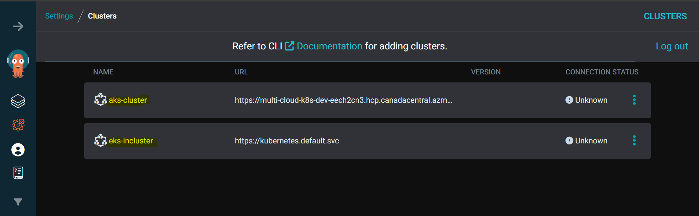

- Application list: prefixed with cluster name

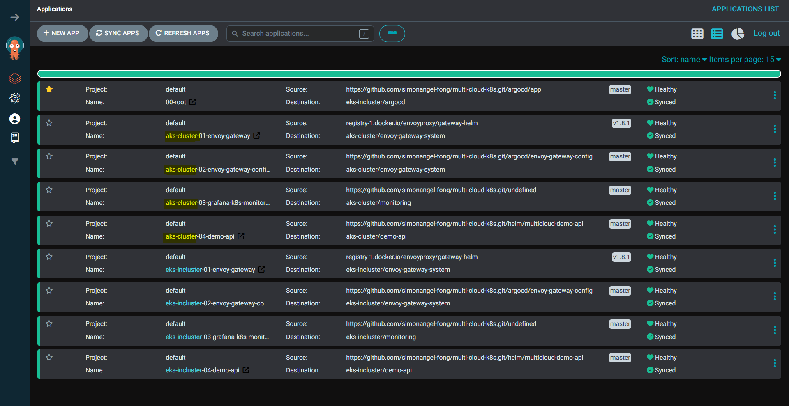

- Application: `Healthy` and `Synced`

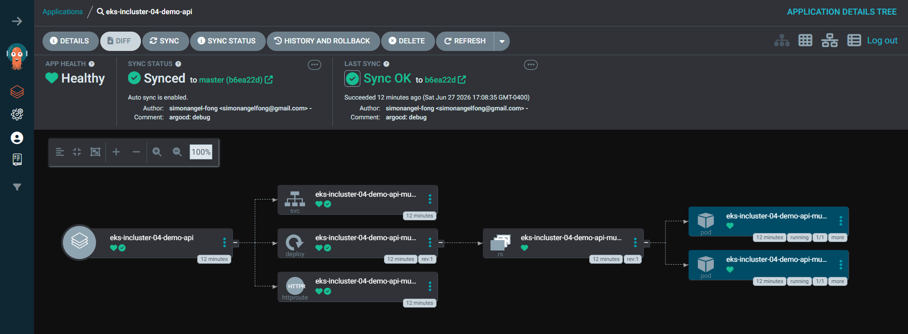

**Infrastructure**

- AWS EKS

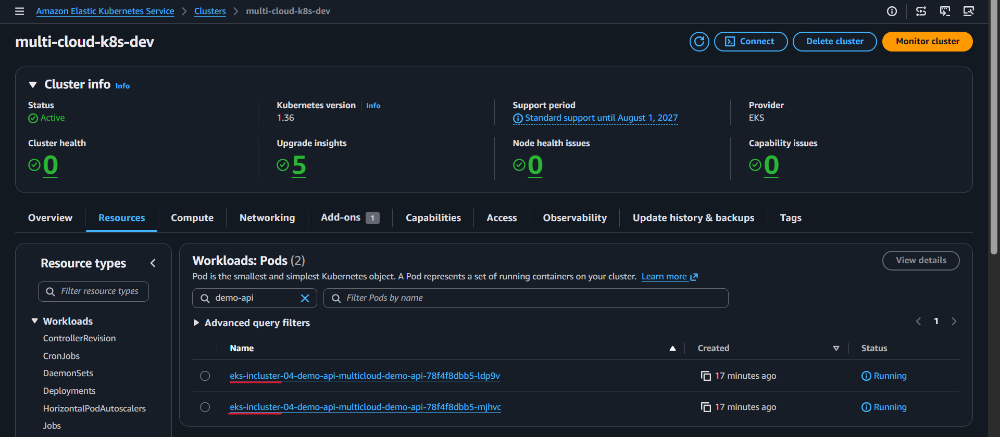

- Azure AKS

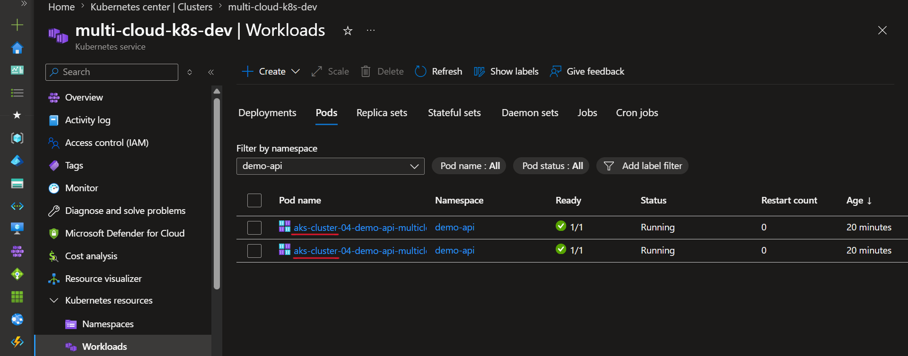

---

## Feature: traffic control with Cloudflare

- A `Cloudflare Load Balancer` sits in front of both clusters and steers traffic between the `AWS` and `Azure` pools.
- Adjusting the **pool weights shifts load** between clouds without touching DNS or the clusters themselves, which is useful for:
  - cost control,
  - failover drills,
  - and gradual cutovers.

**Load balancer (excerpt)**

```hcl
resource "cloudflare_load_balancer" "cloud" {           # Cloudflare load balancer managed by terraform
  zone_id         = data.cloudflare_zone.zone.zone_id
  steering_policy = "random"                            # Steering policy: weighted random across pools

  default_pools = [
    cloudflare_load_balancer_pool.aws.id,
    cloudflare_load_balancer_pool.azure.id,
  ]

  random_steering = {
    default_weight = 1    #  fallback weight for the pool not in pool_weights
    pool_weights = {
      (cloudflare_load_balancer_pool.aws.id)   = 0.8    # 8/2 split: adjust to control traffic
      (cloudflare_load_balancer_pool.azure.id) = 0.2
    }
  }
}
```

---

**Cloudflare Load Balancing**

- `Cloudflare` UI

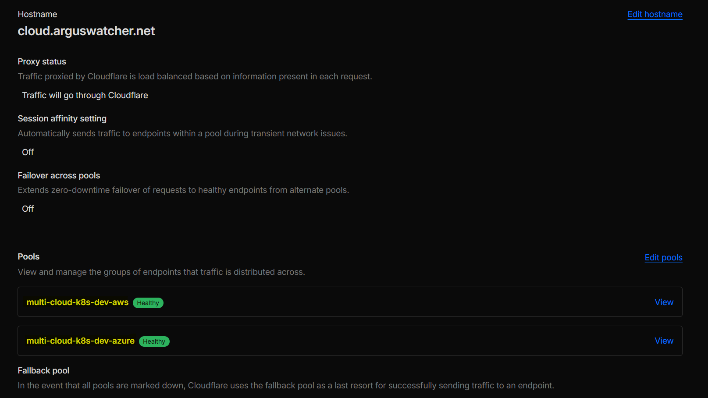

- Test:
  - 21:78 matches the load balancing configuration (2:8)

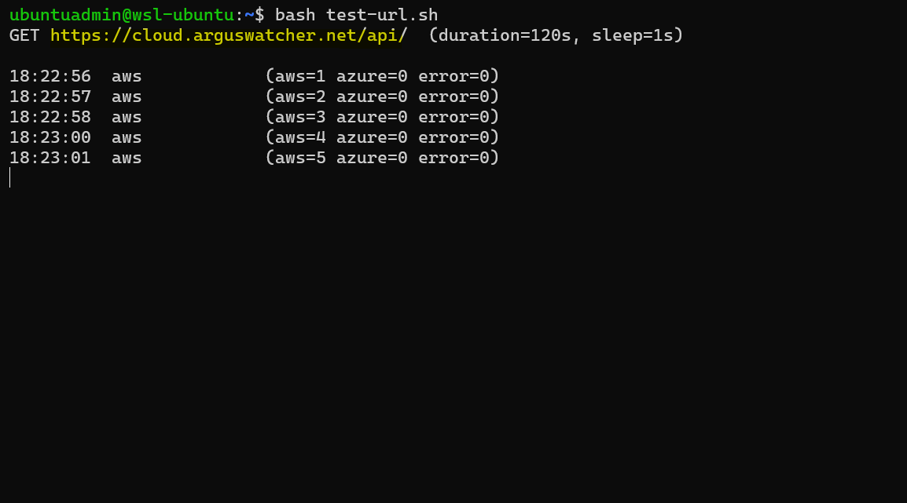

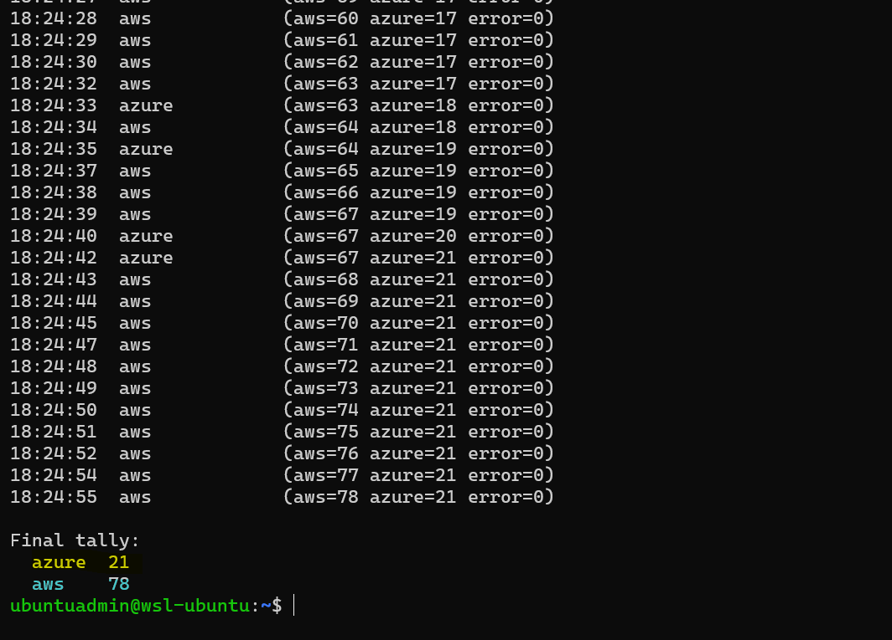

---

## Feature: cloud-agnostic monitoring on Grafana Cloud

Both clusters ship **metrics and logs** to a single `Grafana Cloud` workspace, making **monitoring cloud-agnostic**.

- The demo API **exports** `Prometheus` metrics via a `Go module`.
- `Grafana Alloy` runs in each cluster and **forwards metrics and logs** to `Grafana Cloud`.
- `Grafana Cloud` dashboards render data from both clusters side by side.

**Grafana Dashboard**

- Cluster Overview

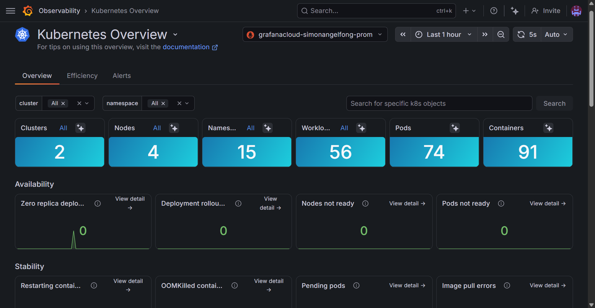

- Cluster list

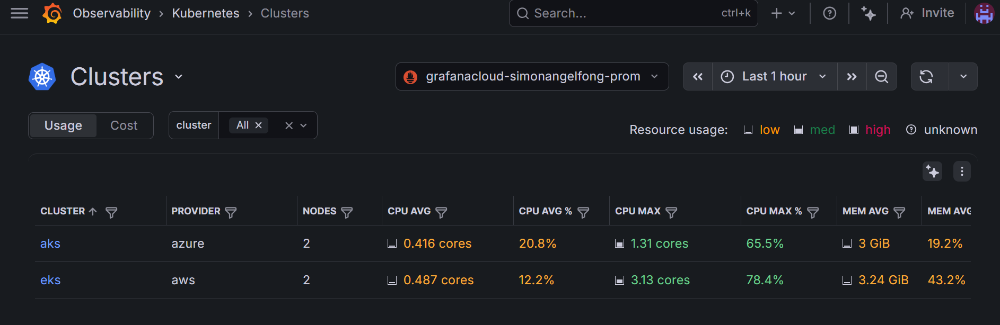

- Cluster: eks

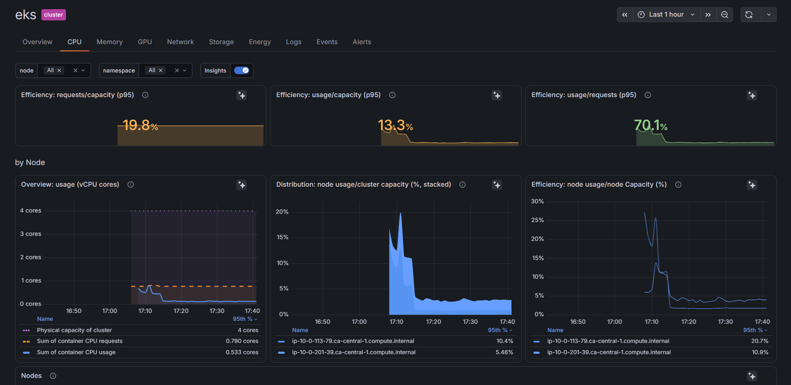

---

## Documentation

- [App (Go demo API)](docs/01-app.md)
- [Helm charts](docs/02-helm.md)
- [Infrastructure / Terraform](docs/03-infra.md)
- [ArgoCD](docs/04-argocd.md)
- [Cloudflare load balancing](docs/05-cloudflare.md)
- [Monitoring](docs/06-monitor.md)
